A step-by-step process to installing Oracle 19c Software for Single Instance Database on Red Hat Enterprise Linux 7.9 (RHEL)


  This Guide is Production Ready.



# Prerequisites

### Install required X11 packages

Install X11 packages with following command based on your operating system release and version:

```bash
yum install xorg-x11-xauth -y
```

### Configure X11 forwarding

To enable X11 Forwarding, change the "X11Forwarding" parameter using vi or nano editor to ```yes``` in the ```/etc/ssh/sshd_config``` file if either commented out or set to no.

```bash
vi /etc/ssh/sshd_config
```
or 

```bash
nano /etc/ssh/sshd_config
```

You should see similar output as the following:

`X11Forwarding yes`

### Install the Dependencies

Install the Following

```bash
yum install libnsl* -y
```

```bash
yum update -y
```
Check if Development Tools are installed

``` bash
yum grouplist
```
 If They are not installed, then execute the Following Command
```bash
yum group install "Development Tools"

```
### Create Oracle Groups and add user
```bash
groupadd -g 3001 oinstall
groupadd -g 3002 dba
groupadd -g 3003 oper
useradd -u 3001 -g oinstall -G dba,oper oracle
```

```bash
passwd oracle
```

### Create the required directories
```bash
mkdir -p /u01/app/oracle/product/19.3/db_home
```

### Change Ownership & Access Permissions
```bash
chown -R oracle:oinstall /u01
chmod -R 775 /u01
```

```bash title="Login with Oracle User"
su - oracle
```

```bash
export CV_ASSUME_DISTID=RHEL8.5
```
### Update the .bash_profile
```title="Using vi editor"
vi .bash_profile
```
```title="Using vi editor"
nano .bash_profile
```


Update the Bash Profile with the following:
```bash
export ORACLE_BASE=/u01/app/oracle
export ORACLE_HOME=/u01/app/oracle/product/19.3/db_home
export LD_LIBRARY_PATH=\$ORACLE_HOME/lib:$CLIENT_HOME/lib:/lib:/usr/lib
export CLASSPATH=\$ORACLE_HOME/jlib:\$ORACLE_HOME/rdbms/jlib:$CLIENT_HOME/rdbms/jlib$
export NLS_LANG=american_america.al32utf8
export NLS_DATE_FORMAT="yyyy-mm-dd:hh24:mi:ss"
export PATH=$PATH:$HOME/.local/bin:$ORACLE_HOME/bin:$CLIENT_HOME/bin
```

## oracle 19c Software Installation

Download the Oracle 19c Software from Oracle's Offical Website Copy it to  `$ORACLE_HOME` location, unzip the software and run below cmd

```bash
./runInstaller
```

### Oracle 19c DB Software Installation Wizard will appear.

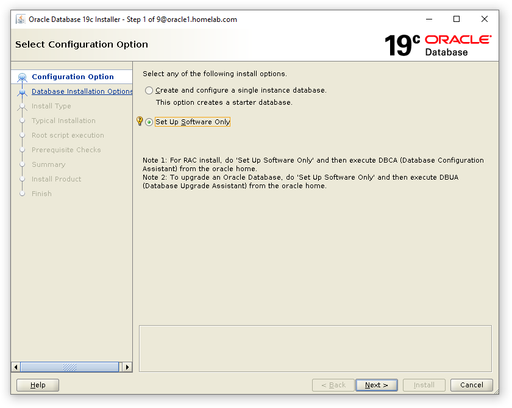
Select 'Setup Software Only'
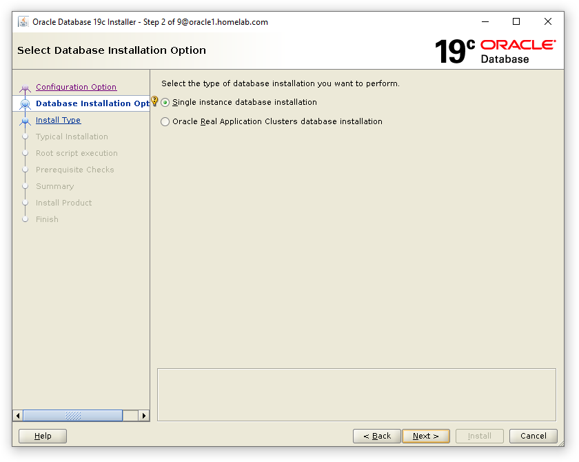
Select 'Single Instance Database Only'
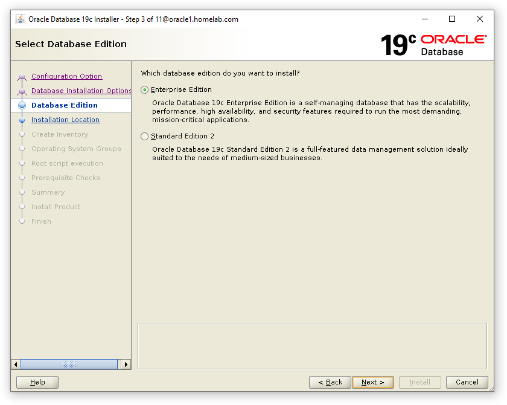
Select 'Enterprise Edition'
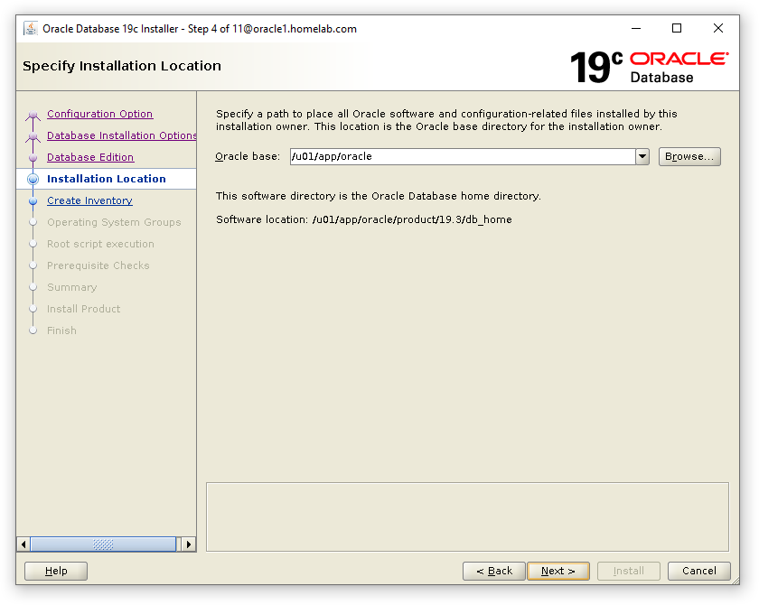
Verify Oracle Base Location and Proceed to the Next Step
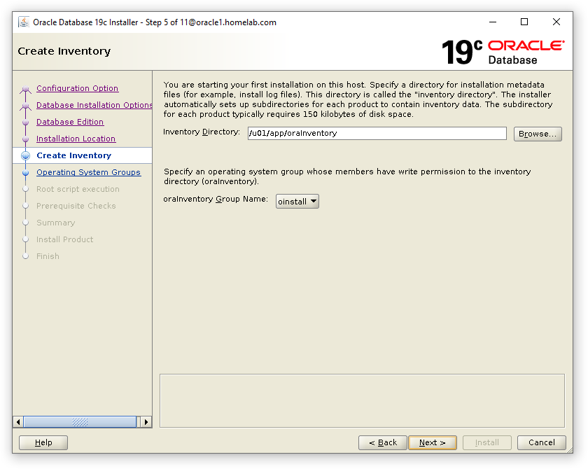
Verify Oracle Inventory Directory and Proceed to the Next Step
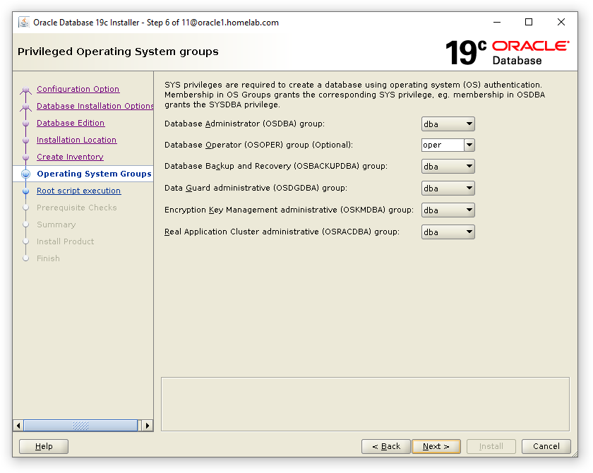
Verify the OS Groups created in the Prerequisite Step above
Select the "Automatically run Configuration Scrips and Select use "root" and enter the root Password Below
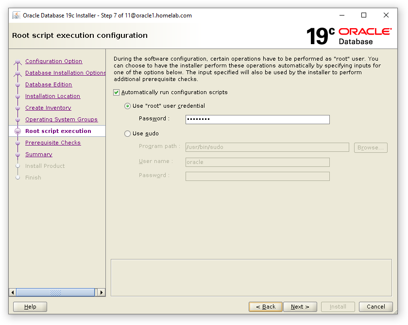

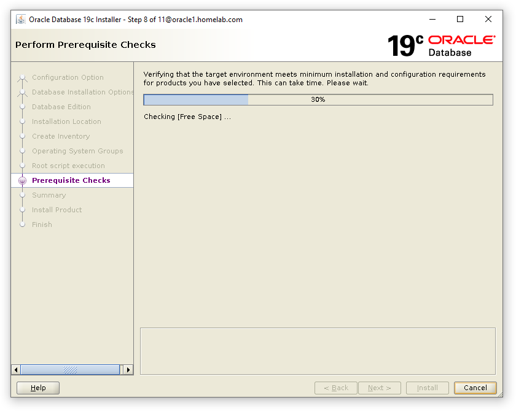

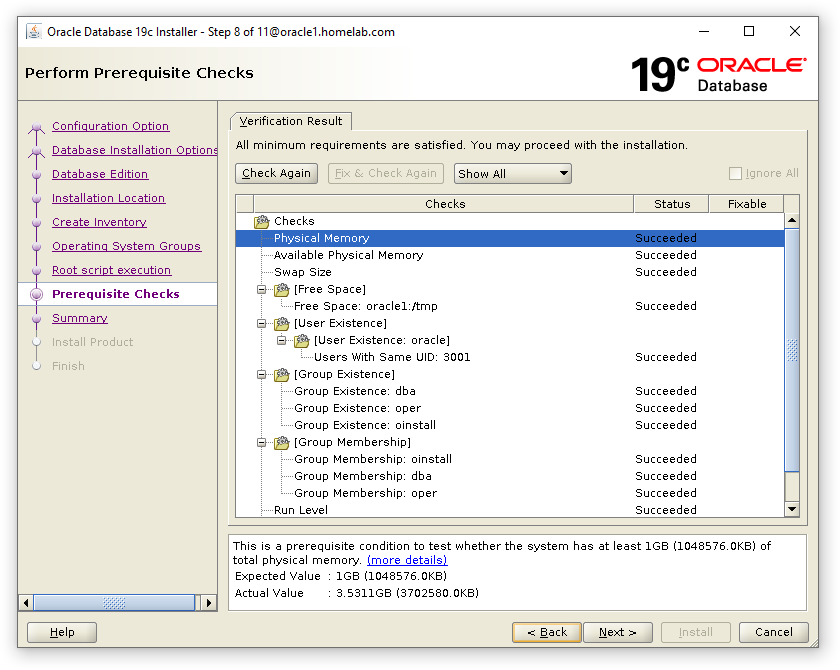

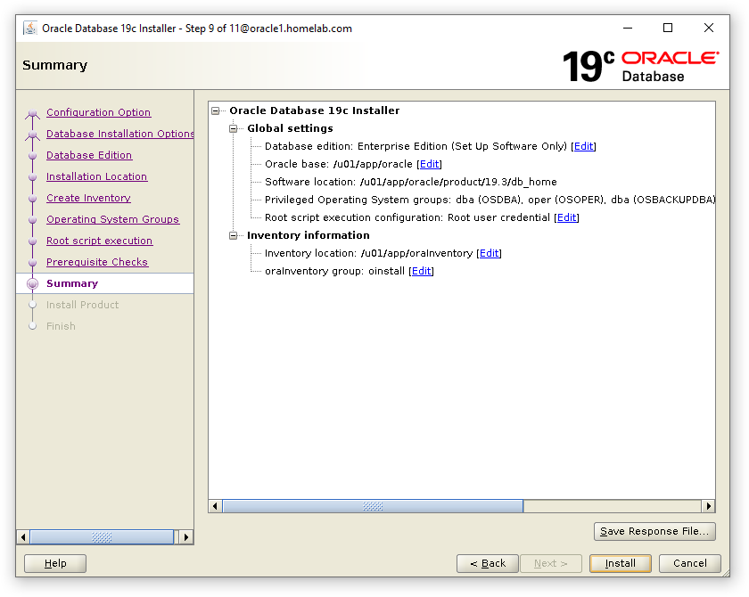

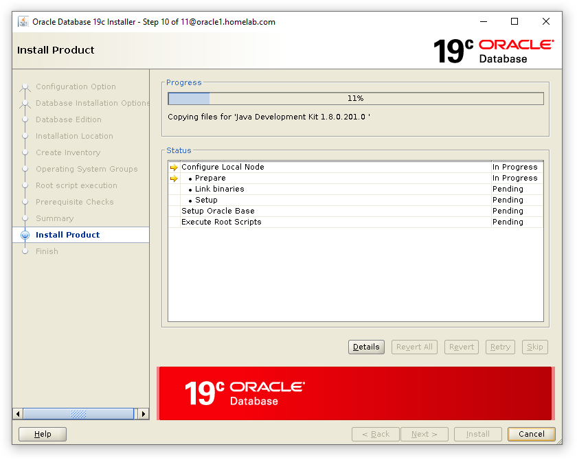
*A single track trail outside of Albuquerque, New Mexico.*
Progress of Oracle 19c Software will begin.


##### Once the Installation has Completed, Execute the following command to verify the sqlplus version.

```bash
sqlplus -v
```

##### You will get the Following Output:


